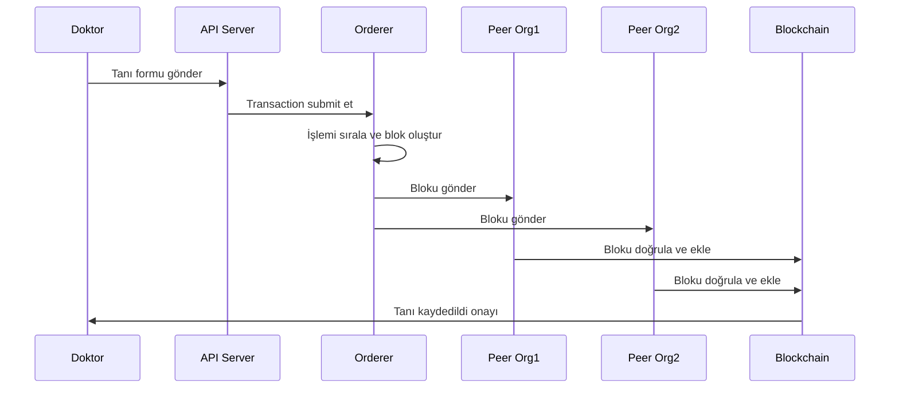

# Tıbbi Blockchain Sistemi - İşlem Akış Diagramı

Bu diagram, tıbbi tanı formunun blockchain'e kaydedilme sürecini göstermektedir.

## İşlem Akış Sırası

## Adım Açıklamaları

1. **Doktor → API Server**: Doktor web/mobile uygulaması üzerinden tanı formunu gönderir
2. **API Server → Orderer**: API server, transaction'ı orderer'a submit eder
3. **Orderer Internal**: Orderer, gelen işlemleri sıralar ve blok oluşturur
4. **Orderer → Peer'lar**: Oluşturulan blok tüm peer'lara gönderilir
5. **Peer'lar → Blockchain**: Her peer bloğu doğrular ve kendi blockchain kopyasına ekler
6. **Blockchain → Doktor**: İşlem tamamlandığında doktora onay gönderilir

## Teknolojik Detaylar

- **Consensus Algoritması**: RAFT (3 orderer ile majority consensus)
- **Validation**: Her peer bloğu bağımsız olarak doğrular
- **Persistence**: Veriler hem peer'larda hem CouchDB'de saklanır
- **Security**: Tüm iletişim TLS ile şifreli, dijital imzalar mevcut

## Gerçek Dünya Süresi

- **Doktor → API**: ~100ms
- **API → Orderer**: ~200ms  
- **Blok Oluşturma**: ~1-2 saniye
- **Peer Validation**: ~500ms
- **Toplam Süre**: ~2-3 saniye

